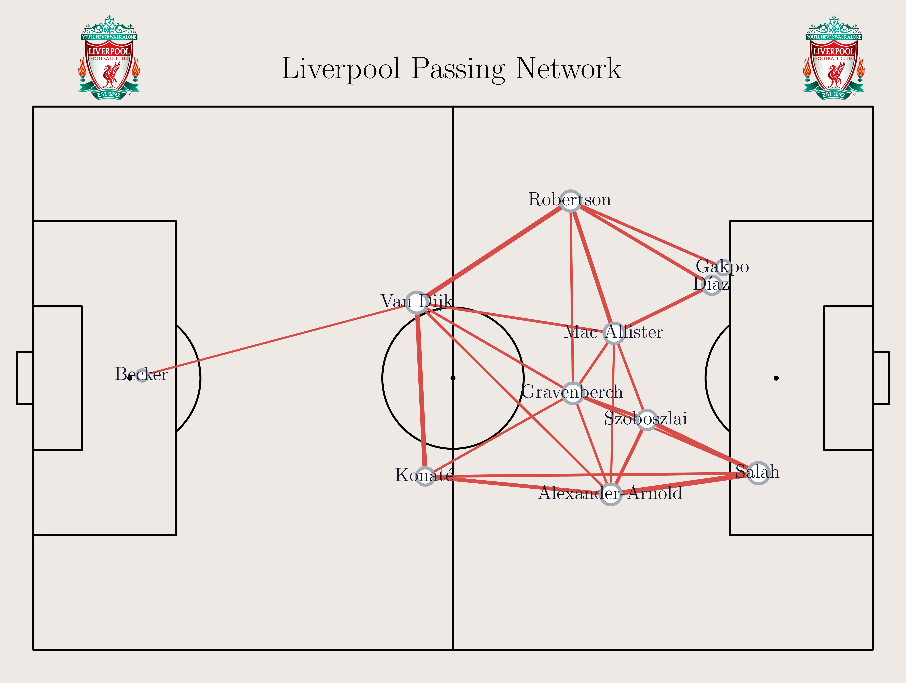
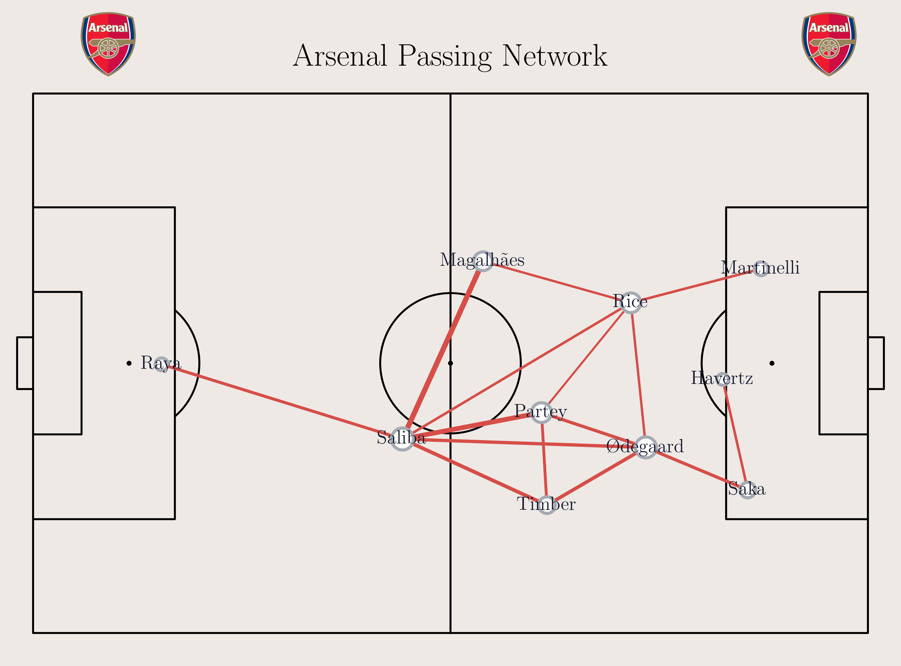
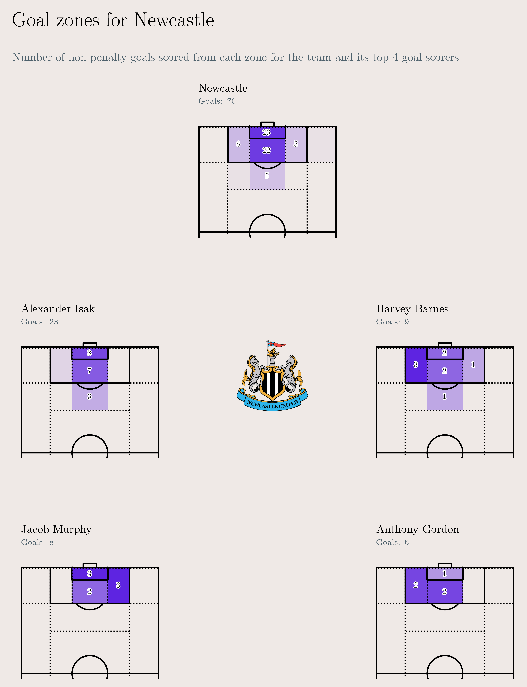
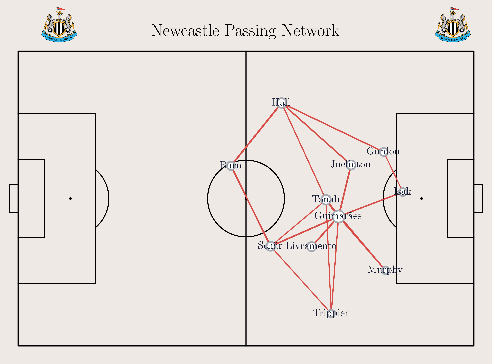

# Attacking styles of the top PL teams

The 2024-25 Premier league season recently came to an end, with it being the second highest scoring season in a 38 game season. A total of 1091 goals were scored, which amounts to an average of 2.87 goals per game. In this post, I examine the attacking patterns of the top 5 teams, with a focus on shot creating actions.

## Top 5 Teams

## Liverpool

Liverpool won the title in the 2024-25 season, their second title in the Premier league era. Star player Mo Salah was the league's top scorer with a total of 29 goals. Liverpool as a team also topped the scoring charts, having found the back of the net 87 times in the season.

Unurprisingly, most of their shots and goals came from the central and right spaces in the penalty box, an area where Mo Salah is prolific. Fellow forwards Luis Diaz and Cody Gakpo also contributed their share to the team's goals, with both of them entering double figures.

Moving on to how Liverpool build up, I looked at the actions leading up to a shot, and illustrated the most active zones on the pitch. The left and right half spaces outside the penalty box see the most action, especially during the earlier phases of build up. This lines up well with Alexis Mac Allister and Trent Alexander-Arnold being the main creative forces during buildup.

What are the types of passes that lead to a shot? I ran a clustering algorithm on all the passes that lead to a shot, and plotted the top 6 clusters. It should come as no surprise that the most common cluster of passes are those that are looking for Salah. Both Cody Gakpo and Luis Diaz, when operating on the left like to cut in onto their right foot and put in a cross into the box. The second most common cluster of passes originating from Liverpool's right half spaces. These passes are mostly crosses from Trent Alexander-Arnold's right foot, or Salah's left. Finally, the third most common cluster of passes look like through balls from central spaces searching for Salah.

Putting it all together, I visualized the passing network for all the passes played in the buildup to a shot. This shows that Liverpool have a stable core, and have been a cohesive unit all season. Each of the 3 starting midfielders - Gravenberch, Mac Allister, and Szoboszlai are well linked to each other, and do a good job in connecting defense to attack. In attack, Cody Gakpo and Luis Diaz like to play more centrally, while Salah holds the width on the right and likes to drift inwards to take a shot.

## Arsenal

Arsenal had a disappointing season compared to their previous two campaigns. They ended the season trophyless, and failed to muster a title challenge. Injuries to key players also didn't help, with Saka, Ødegaard and Havertz amongst others missing a significant chunk of the season.

Having scored 91 and 88 goals respectively in the two seasons prior, Arsenal's goal tally of 67 represents a significant drop. They also had over a 100 fewer shots than Liverpool, with the most number of shots falling to Trossard who had almost half the number of shot attempts as Salah. However, Arsenal's attack is pretty balanced, with a significant number of shots being created from either side. And despite not having a prolific goalscorer, players like Trossard, Merino, and Havertz have chipped in with crucial goals.

Arsenal's most dangerous zone during buildup is the right half space. This is also where their most creative players in Ødegaard and Saka like to play. With speedy wingers like Saka and Martinelli, they also like to go down the line on either side and look for crosses and cutbacks.

A lot of Arsenal's passes that led to a shot look like through balls into the penalty area from the right half space. They also create a significant number of shots from crosses out wide on the left, and the half spaces on the right.

Looking at Arsenal's passing network during shot creating plays, their structure tends to lean to the right side of the pitch. The wide players in Saka and Martinelli like to drive towards the byline and pick out passes to their teammates. Saliba, as a ball playing center back is well connected to all 3 of Arsenal's starting midfielders. The passing network is missing a left back because Arsenal haven't had a consistent left back all season. Zinchenko, Timber, Calafiori, and Myles Lewis-Skelly have all played there at some point in the season.

## Man City

Man City had a really poor season by their standards. After winning 4 consecutive league titles, they were nowhere close to challenging for the title, and almost missed out on Champions league qualification.

With 73 goals scored, this was their lowest scoring season since the 2015/16 season. Star striker Erling Haaland was their top scorer with 22 goals. The fact that January signing Omar Marmoush was their second top scorer highlights some of their attacking struggles.

Looking at City's shot map, it is interesting to see that 37% of their shots came from outside the box. This is higher than any of the other top 5 teams. Pep Guardiola has a reputation for coaching his teams to retain possession, and play the perfect pass to set up a goal. So, it is surprising to see them shoot from distance so often. Another thing to note in their shot map is that besides Erling Haaland, the rest of the top 4 shooters in the team played around 1700 minutes each this season (Haaland in comparison played 2700 minutes). This further emphasizes the lack of a consistent "partner" for Haaland.

One of the hallmarks of City's play style is playing sideways passes in front of a low block trying to find the perfect moment to play a defense splitting pass. So, naturally a big portion of their active zone would be in central spaces outside the penalty box. City's left hand side is also an area where they find a lot of joy. Defender Josko Gvardiol loves to push forward, and also fancies a shot at goal every now and then. In front of him, mercurial winger Jeremy Doku is a constant threat, making driving runs to the byline in an attempt to find a teammate with a cross or a cutback.

Most of the shot leading passes originate in the wider areas. However, there is a difference between either side. On City's left, there are more passes that look like cutbacks or crosses across goal. On the right, there are more passes aimed to the edge of the penalty area leading to shots from distance.

The City passing network before a shot looks a bit overwhelming because of the number of players they have used all season. City love to pass the ball before creating a shooting opportunity, so there should be no surprise to see a number of strong links.

## Chelsea

Chelsea had an interesting season. They had a really good first half of the season, and then had a massive drop off in the second half of the season. However, they were able to rally towards the end of the season to finish 4th and qualify for the Champions league on the final day. After a turbulent couple of years, Chelsea seem to be back on track again.

This change of fortune would not be possible without Cole Palmer. He leads the team in both goals and assists. He has a very balanced shot map, going for goal from both left and right, and from distance too. He is backed up in the scoring department by Nicolas Jackson in front of him, and Noni Madueke on the right.

Chelsea's creativity in buildup mostly comes from central spaces. Cole Palmer tends to float in these areas, and is well supported by Enzo Fernandes. In addition, Moises Caicedo, who tops Chelsea's progressive passers' list is instrumental in earlier stages of buildup.

Chelsea's top two pass clusters are almost mirror images. Noni Madueke and Pedro Neto top Chelsea's progressive carries list, and they love to take on defenders and put in a cross. Cole Palmer finds himself as one of the main passers in the top 3 clusters. He floats across the central and half spaces, and likes to put crosses and through balls into the box from those areas.

The passing network shows that Chelsea's midfield is a cohesive unit during buildup. Caicedo in the number 6 role has strong links with all the 4 defenders, as well as Palmer and Fernandez. The latter two in turn have strong links with the more attacking players. One of the drawbacks of using a passing network is that it cannot effectively represent players who have played multiple positions (especially when they are on opposite sides of the pitch). So, Madueke and Neto who have played significant minutes on either side of the pitch show up next to each other in the passing network.

## Newcastle

Newcastle had one of their best seasons in recent memory. Despite not making any summer signings, they qualified for the Champions league, and won the Carabao Cup.

Alexander Isak had his best season, finishing second in the goalscoring charts with 23 goals. Newcastle's shot map was balanced, with about an equal number of shots and goals originating from either side of the pitch. Jacob Murphy was one of the unsung heroes of the season providing the second highest number of assists in the league, and amassing a respectable goal tally of 8 goals.

Newcastle have a very strong central midfield, with Sandro Tonali and Bruno Guimarães setting the tempo of how they buildup. On the left, Anthony Gordon and sometimes Alexander Isak like to cut in and partake in the buildup.

Newcastle's final ball leading to a shot usually comes from the wider areas. However, there is a a difference between the two clusters of passes. In the first cluster, originating on the left, the pass originates closer to the center and further away from the goal. This is because this space is occupied by a right footer who likes to cut in, in Anthony Gordon or Harvey Barnes. On the right, the passes originate slightly wider, closer to the goal. This is the benefit of having a right footer in Jacob Murphy playing there.  

Newcastle have had a pretty consistent team for the majority of the season. There were chunks of the season where Harvey Barnes replaced Anthony Gordon on the left, and Trippier played at right back forcing Livramento to move to left back. The passing network illustrates the difference between the way Trippier and Livramento play. Trippier likes to keep the width, and likes the ball at his feet. Livramento is more of a runner, with a high number of progressive carries, and the ability to make intelligent off the ball runs.

