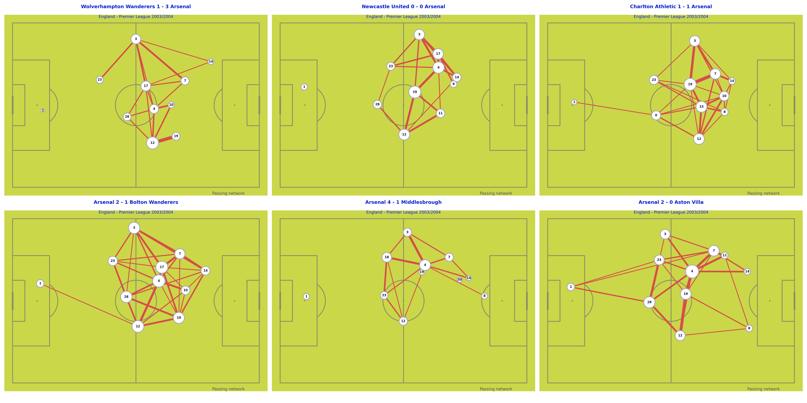
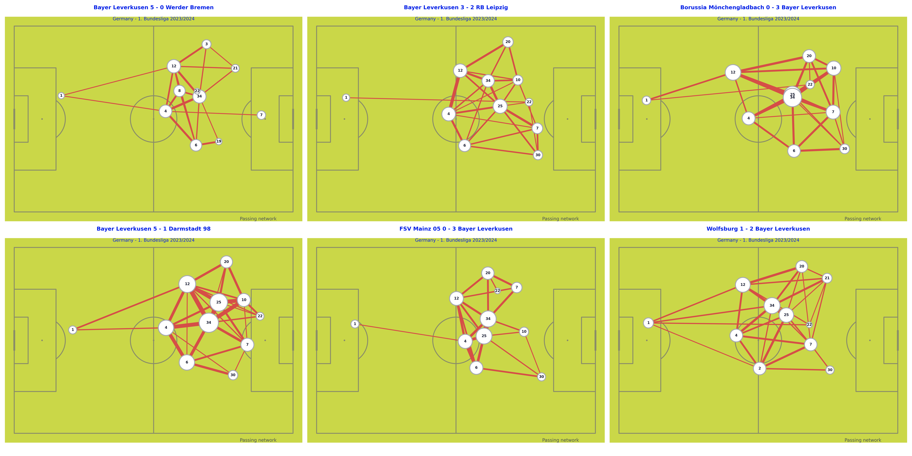
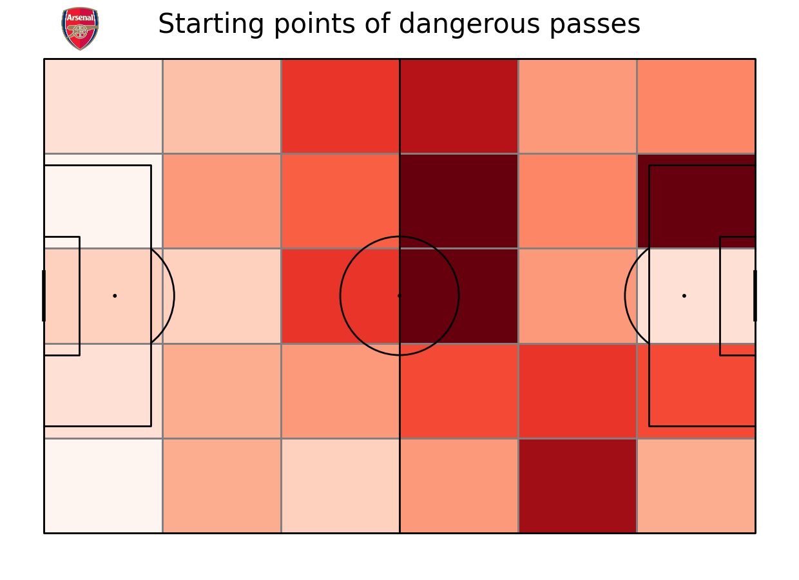

# A tale of two invincibles

There are two teams this century that managed to go the entire league season unbeated - Arsenal in 2003/04 and Bayer Leverkusen in 2023/2024. Both incredible achievements. But how do they compare? And what does that say about the evolution of the game in the past 20 years? Let us find out.

## High level stats

The high level overview of the two teams shows that Leverkusen was a much more attacking team in their invincibles season, averaging 2.53 goals per game. Meanwhile, Arsenal had a slightly stronger defence, conceding an average of 0.66 goals per game. But are these trends reflected in some of the lower level metrics too? Let's find out

## How do the teams lineup

In the above two figues, I have chosen 6 games for each team from their respective invincibles season, and plotted the passing networks. These futher emphasize how dominant in attack Leverkusen were. There are games where the average position of the entire Leverkusen team is in the opposition half.

These passing networks also show the differences in the playing styles of the two teams. One of the clearest differences is that Arsenal played 4 at the back vs Leverkusen playing 3. In addition, the Leverkusen defense liked to pass the ball around in defense, with all of their center backs being well connected.

## How close were they to losing their undefeated streak?

This is one metric in which Arsenal were very comfortable. They were never trailing a game after the 90th minute. However, Leverkusen were behind on 3 separate occasions:

- vs Bayern Munich where they equalized in the 4th minute of stoppage time
- vs Borussia Dortmund where they equalized in the 7th minute of stoppage time, and
- vs Stuttgart where they equalized in the 6th minute of stoppage time

## Key players and threat

Unsurprisingly, Thierry Henry was the main man for Arsenal. With 30 goals, he was well clear of Robert Pirès who was in second place with 14 goals. None of the rest of the Arsenal players managed more than 4 goals in the season. What makes Henry's 30 goals more impressive is that he achieved them with an xG of 23.88, thereby significantly overperforming his expected goals for the season. When it comes to Arsenal's assists, they were more spread out between the team. It was a 3 way tie at the top with Thierry Henry, Robert Pirès, and Dennis Bergkamp all sharing 6 assists.

Bayer Leverkusen's stats were pretty much the opposite of Arsenal's. The bulk of their scoring was shared between Alejandro Grimaldo (10), Florian Wirtz (11), and Victor Boniface (14). However their assists were dominated by Grimaldo (13), and Wirtz (11). The dangerous passes heatmap further emphasizes this by highlighting the left central space outside the penalty area as the most dangerous zone, a space where both Wirtz and Grimaldo operate.

## Conclusion

What Leverkusen and Arsenal did were both incredible achievements, and a sign of what it takes to succeed in different eras. The early 2000s was a more pragmatic time, with star players capable of carrying their teams. However today, football is more collaborative, and high intensity.
