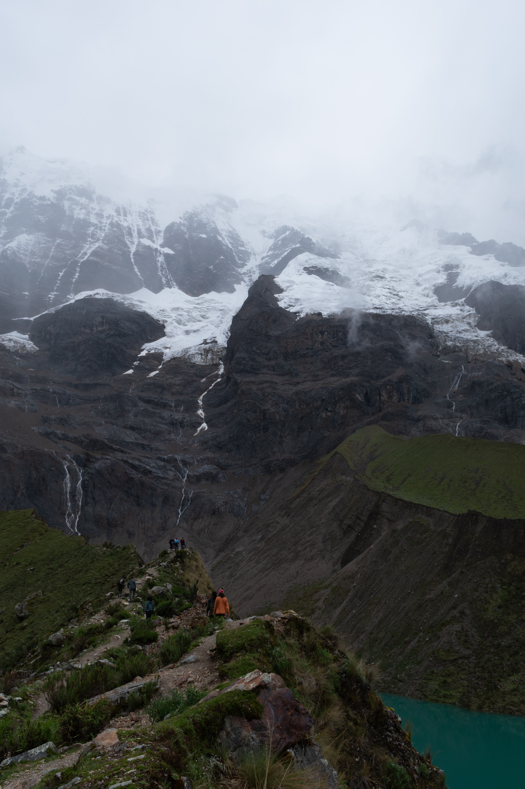
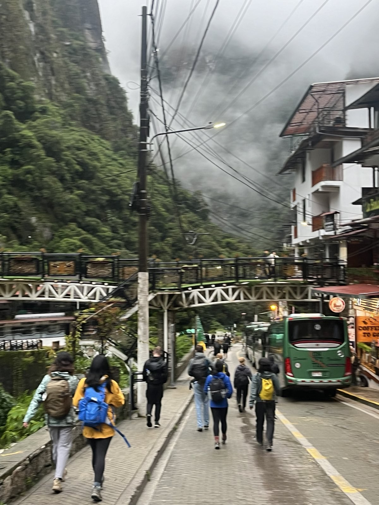

# Hiking Machu Picchu

Machu Picchu, the crown jewel of the Inca Empire, and now visited by millions around the world. I was one of the ones lucky enough to make this journey. There are multiple ways to visit Machu Picchu - a train + bus combo, or you can hike anywhere between 2 to 8 days. The one I chose to do was the 5 day Salkantay trek, and it was one of the most memorable trips of my life

## Pre hike prep

The day before the start of our hike, we had an orientation with our guides, Carlos and Brian of [Machu Picchu reservation](https://www.machupicchureservations.org/tour/salkantay-trek-5-days). I also met the rest of my group on this day, and surprisingly I ran into someone I met on a bus in Honduras 3 months prior. Small world!

## Day 1

Before I did this hike, people told me that the second day is the hardest. But for me, day 1 was the most challenging. It started with a 4am rise, and a walk to the pickup point in Cusco. I got in the van, and tried to catch up on some lost sleep. The journey to the trailhead was 4 hours. We stopped for breakfast, and that brought everyone to life. The ride from the breakfast place to the trailhead was a lot more lively, and everyone was getting to know each other.

The town the trailhead was in is called Soraypampa, and it is at 3900m elevation. We arrived there, and met the horsemen. They were going to be carrying a part of our luggage to the first campsite. We handed our duffel bags to them, and started our journey to Humantay Lagoon. This was at 4250m elevation. Within the first 10 minutes of hiking, I was absolutely winded. I had been in Cusco for a while, and thought I had acclimatized to the altitude, but apparently not. But, no big deal. Slow and steady, and I eventually reached the lagoon. Seeing a pristine turquoise lake with snowcapped mountains in the backdropped was absolutely breathtaking.

From the lake, we went back down the way we came, and made it to our campsite by lunch time. The campsite had a bunch of little cabins along a steep incline, and the dining room at the very top. This turned out to be an inconvenience nobody enjoyed. You really did not want to make multiple trips between your cabin and the dining room. So, once we had lunch, we spent the rest of our day hanging out at the dining room, playing cards, drinking coca tea, and before you know it, it was time for bed.

## Day 2

This was the longest day of the hike. We were woken up at 4:30am with a cup of coca tea, and were served breakfast almost immediately after. After breakfast, we gave our duffel bags to the horsemen, and set out for the day. We were covering 22km on this day. The first 3 hours of the day's hike was a gradual ascent to the highest point of the trek, the Salkantay pass at 4650m of altitude.

After reaching the Salkantay pass, it was pretty much all downhill. We ended the day in the tropics, at an altitude of 2900m. Luckily this campsite had showers, which was very much needed after hiking for 13 hours. We freshened up, had dinner, and were soon in bed.

## Day 3

This was by far the easiest day of the hike. We set out at 6am, but only had 15km to cover. The terrain was flat, and the path was wide. We breezed through the hike, and were at our campsite by lunchtime. This was also the fanciest campsite, with all of us staying in little glass domes. It was more of a glamping experience. This was also the first campsite that had hot water.

We also had the option of ziplining or visiting hot springs. Every one of us decided to go to the hot springs. It was the perfect way to nurse our aches and pains from the previous two days. By this time in the trip, it felt like a very tight knit group. We were isolated from the outside world, and only had each other for company. We ended the night with some music, and alcohol. Nobody wanted to go to bed, but we had to because we had another 4am rise.

## Day 4

Day 4 was also a super long day, with another 22km on the day's agenda. A few of us were still nursing a bit of a hangover when we started, but we eventually shook it off and got in the groove of things. A highlight of day 4 is that this is the first time you can see Machu Picchu from the distance.

By afternoon, we had finished all the ascending and descending for the day, and had to walk the final 3 hours alongside train tracks. This was not physically hard, but given everything we had been through the past few days, I just wanted it to be over. Finally by evening, we reached the town of Aguas Calientes, where we were spending the night. This is a bustling little town, with shops, and restaurants everywhere. We had our last meal together at a local restaurant, and were given our tickets to visit Machu Picchu the next day.

## Final stretch

I was given the 7am slot for Circuit 2. This meant that I had to leave the hostel by 5:30am to make it on time. I had a light breakfast, and then set off on foot with the rest of the 7am crew.

We were no longer accompanied by Carlos and Brian, but the route was pretty straightforward. It was a half hour walk from Aguas Calientes, and then a 1 hour hike up 2000 stony steps. The last bit seemed never ending, and there were points where I was worried we wouldn't make it on time, but we made it with time to spare.

Once we were up there, we met up with our guide who took us around the ruins, and explained the history of the place. It was incredibly surreal being there, and to think that 5 days of hiking led to this moment. The ruins of Machu Picchu are absolutely spectacular, but for me, this was more about the journey than the finish.

