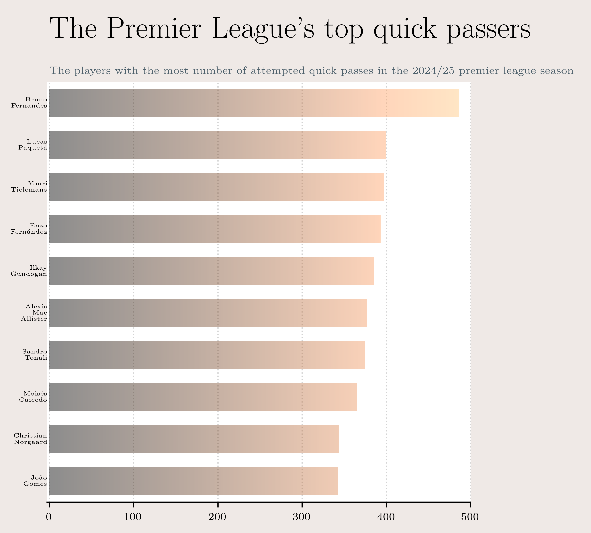
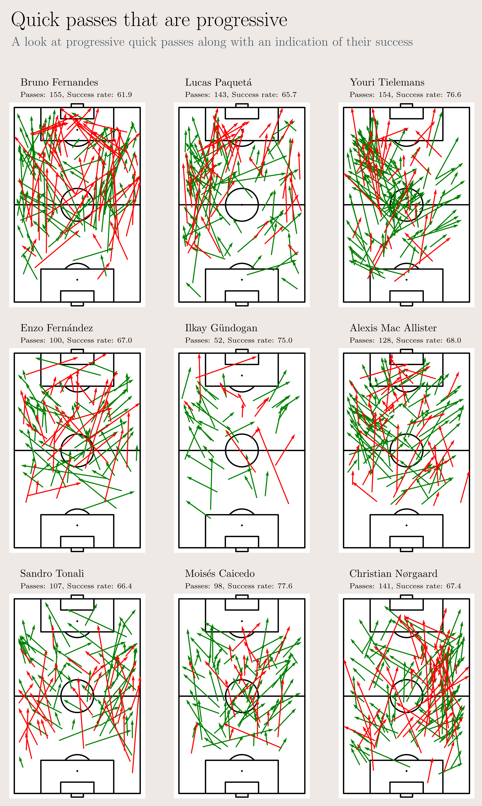
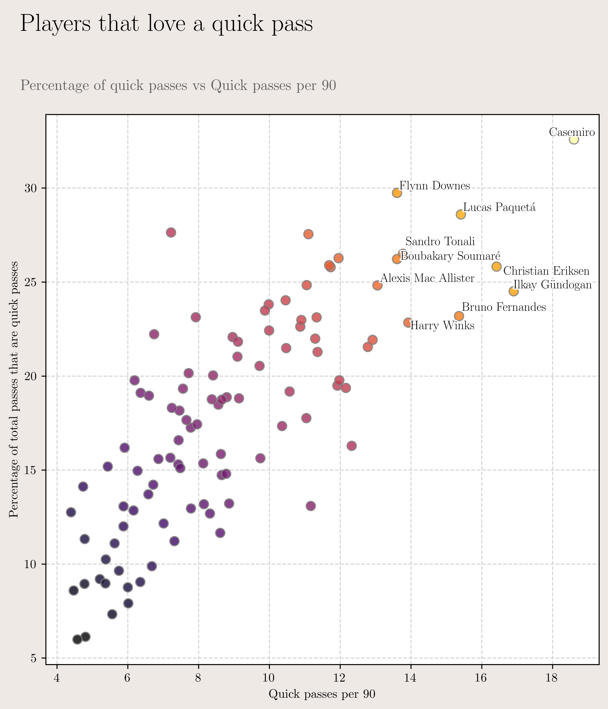
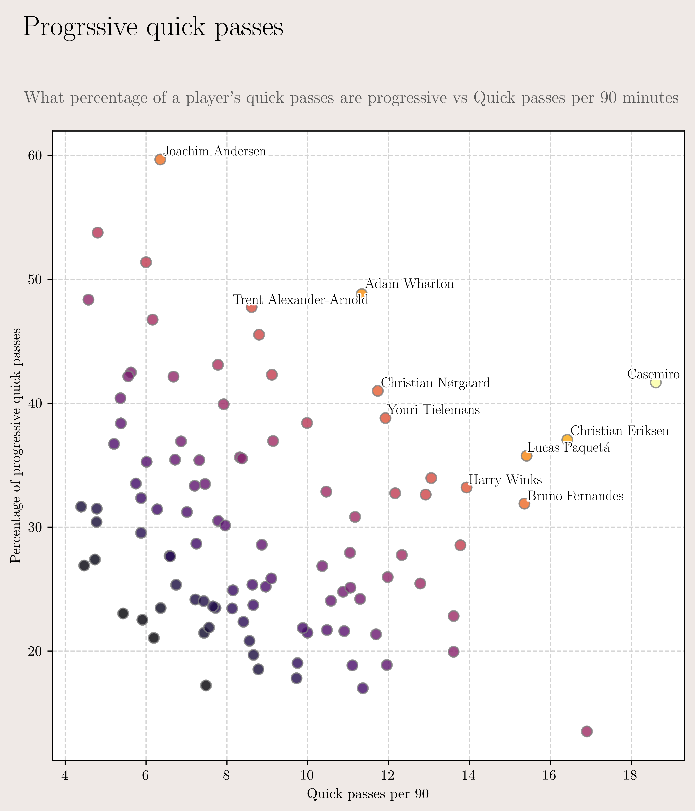

# Quick passers

The premier league is the most intense football league in the world. Most players who move to the premier league are taken aback by how little time they have on the ball. As soon as they receive the ball, there is someone breathing down their neck. This makes the ability to play quick one touch passes a key skill for a footballer in the premier league. In this post, I take look at who the top quick passers are from the 2024/25 season, and dig deeper into their numbers.

## Top Quick Passers

For the purposes of this analysis, I have defined a quick pass as a pass that is executed within 1 second of receiving the ball from a teammate.

Looking into the numbers, Bruno Fernandes is by far and away the top quick passer in the premier league, with a total of 486 attempted passes. He is some distance ahead of Lucas Paqueta in second place, who has 400 attempts.

An interesting observation about the top 10 quick passers is that all of them are central midfielders. This is further emphasized by the heatmap below. An overwhelming majority of these passes are being initiated in the middle section of the pitch.

You also see two types of players emerge in this plot - 1) Players like Bruno Fernandes and Sandro Tonali who are playing quick passes across the length of the pitch, and 2) Players like Youri Tielemans and Alexis Mac Allister who are more active in the opponent's half.

Ilkay Gundogan and Youri Tielemans stand out with their high pass completion rates. Ilkay Gundogan has a completion rate of 93%, which is the highest among all players in the top 10 quick passers. While Tielamans comes a close second with an 88.2% pass completion rate. However, an analysis of progressive passes tells a different story.

Here, I have defined a progressive pass as one that moves the ball at least 5m towards the opposition goal. We see that Tielemans has attempted about 3 times the number of Gundogan's progressive passes, and his completion rate is also higher. This suggests that Tielemans is not just completing passes quickly but also helping move the ball forward. Bruno Fernandes, despite attempting the most number of progressive passes also has the lowest pass completion rate among the top 9 quick passers. This could be a symptom of the lack of cohesion in the Manchester United squad.

## Who loves a quick pass?

Beyond the number of passes attempted and completed, it is also interesting to look at how often a player attempts a quick pass. In the plot below, a player's penchance for a quick pass is compared to the number of quick passes they attempt per 90 minutes. Casemiro stands out here, with 32% of his attempted passes being quick passes. And not only that, he also plays the most number of quick passes per 90 minutes. We also see his Man United teammates in Bruno Fernandes and Christian Eriksen post high numbers in both departments, perhaps an indication of the type of football they are trying to play.

Focusing our analysis on progressive quick passes, the plot below shows what percentage of a player's quick passes are progressive and compares it to their number of quick pass attempts per 90 minutes. We notice a trend where the higher the percentage of progressive quick passes, lower is their number of passes per 90. The player with the highest percentage of a progressive passes is Joachim Andersen, who is a defender. This makes sense as defenders are under less pressure to play quickly, and have a lot more options to progress the ball forward. A particular standout for me in this is Adam Wharton, who has close to a 50% progressive pass percentage, while still playing a respectable number of quick passes per 90 minutes.

## Final thoughts

Quick passes are an important tool in a player's arsenal. Sometimes they are necessary, and sometimes they define a style of play. There are many ways this analysis can be expanded upon. For example, access to tracking data can help determine the determine the difficulty and quality of a pass, which can further enhance the analysis. However, event data is a great place to get started, and shine the light on players making an impact with their quick passing skills.
